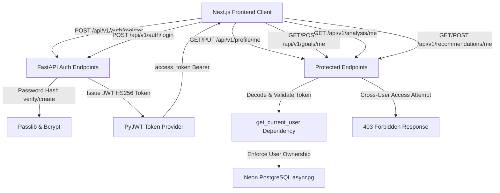

# Authentication & Multi-User Security Architecture

## Overview

The FinanceAI (ArthaAI) platform integrates a production-grade, multi-user authentication and authorization system backed by live **Neon PostgreSQL**.

This system converts the application from single/dummy user mode to an isolated multi-tenant architecture where every registered investor has their own securely partitioned financial profile, financial goals, deterministic risk analysis, and personalized recommendation reports.

---

## Architecture Flow



---

## Core Security Components

### 1. Password Security & Hashing
- **Algorithm**: `bcrypt` via `passlib[bcrypt]`.
- Plaintext passwords are never stored or logged in any database or error trace.
- Hashes are validated during login via constant-time comparison against the `users.password_hash` column.

### 2. Token Provider (JWT)
- **Token Format**: Standard JSON Web Token (JWT) signed with HMAC-SHA256 (`HS256`).
- **Secret Key**: Configurable in `backend/.env` via `SECRET_KEY`.
- **Expiration**: Configured default `ACCESS_TOKEN_EXPIRE_MINUTES = 1440` (24 hours).
- **Payload Claims**:
  ```json
  {
    "sub": "user_id_as_string",
    "email": "user@example.in",
    "exp": 1788936789
  }
  ```

### 3. Server-Side Ownership Enforcement
To eliminate horizontal privilege escalation (IDOR vulnerabilities), all endpoints enforce user ownership:

- **Convenience `/me` Endpoints**:
  - `GET /api/v1/auth/me`
  - `GET /api/v1/profile/me`
  - `PUT /api/v1/profile/me`
  - `GET /api/v1/goals/me`
  - `GET /api/v1/analysis/me`
  - `GET /api/v1/recommendations/me`
  - `POST /api/v1/recommendations/me`

- **Parameterized Endpoints (`/{user_id}`)**:
  - When invoked with an `Authorization: Bearer <token>` header, the `get_current_user` / `get_optional_current_user` dependency compares `current_user.id` against the route `user_id`.
  - If a user tries to view, modify, or generate recommendations for another user's `user_id`, the system immediately returns:
    ```json
    {
      "detail": "You do not have permission to access or modify another user's financial profile."
    }
    ```
    with status code `403 Forbidden`.

---

## Database Migration & Schema

The `users` table schema in Neon PostgreSQL includes:

| Column | Type | Constraints | Description |
|---|---|---|---|
| `id` | `INTEGER` | `PRIMARY KEY`, `AUTO_INCREMENT` | Unique user identifier |
| `email` | `VARCHAR` | `UNIQUE`, `NOT NULL`, `INDEXED` | User email address |
| `password_hash` | `VARCHAR` | `NOT NULL` | Bcrypt hashed password |
| `full_name` | `VARCHAR` | `NULLABLE` | Display name of the investor |
| `is_active` | `BOOLEAN` | `DEFAULT TRUE` | Active account flag |
| `created_at` | `TIMESTAMP WITH TIME ZONE` | `DEFAULT now()` | Account creation timestamp |
| `updated_at` | `TIMESTAMP WITH TIME ZONE` | `DEFAULT now()` | Last update timestamp |

Alembic Migration ID: `e8f12a34b5c6` (`add_user_auth_fields`).

---

## Frontend Integration

### 1. `useAuth` React Context Hook
Located at [`frontend/hooks/useAuth.tsx`](file:///c:/Users/Admin/Desktop/Finance-system/frontend/hooks/useAuth.tsx), providing:
- `user: UserAuthResponse | null`
- `token: string | null`
- `isAuthenticated: boolean`
- `isLoading: boolean`
- `login(credentials)`
- `register(payload)`
- `logout()`

### 2. Automated Token Injection in `apiClient`
Located at [`frontend/services/api.ts`](file:///c:/Users/Admin/Desktop/Finance-system/frontend/services/api.ts), automatically attaching `Authorization: Bearer <token>` to all outbound requests and handling `401 Unauthorized` token expiry gracefully.

### 3. Route Protection
- `<ProtectedRoute>` component guards private routes (`/dashboard`, `/profile`, `/goals`, etc.) and redirects unauthenticated visitors to `/login`.
- `Navbar` dynamically updates between guest actions (`Sign In`, `Register`) and authenticated actions (user avatar chip, `Logout`).

---

## Verification & Testing

Run all unit and integration tests using pytest:
```bash
pytest backend/tests/test_auth.py -v
```
